# 🎬 Movie CRUD Web App – PHP + MySQL

Este projeto é uma aplicação **CRUD** completa (Create, Read, Update, Delete) desenvolvida com **PHP** e **MySQL**, com foco no gerenciamento de um catálogo de filmes. Ele oferece uma interface moderna e intuitiva, com suporte a upload de imagens, login de usuários e pesquisa por categorias.

---

## 📚 Descrição

A aplicação permite que o usuário:

- 📝 Cadastre filmes com imagem, descrição, categoria, etc.  
- 👁️ Visualize todos os filmes cadastrados em cards otimizados para telas desktop
- 🔍 Pesquise filmes por categorias ou por nome  
- ✏️ Edite as informações de um filme  
- ❌ Delete qualquer registro com confirmação  
- 👤 Cadastre-se e faça login com sistema de autenticação simples

---

## 🧱 Estrutura do Projeto

```
crud_web_app/
├── index.php                       # Entrada principal
├── app_web.sql                     # Script SQL para criação e preenchimento do banco
├── includes/                       # Includes de configuração e cabeçalho
│   ├── config.php                  # Configurações gerais
│   ├── db.php                      # Conexão com o banco de dados
│   └── header.php                  # Cabeçalho comum
├── controllers/                    # Scripts para ações CRUD
│   ├── create_movie.php
│   ├── create_user.php
│   ├── delete_movie.php
│   ├── logout_user.php
│   ├── read_all_movie.php
│   ├── read_login.php
│   ├── read_movies_category.php
│   └── update_movie.php
├── pages/                          # Páginas de navegação
│   ├── home.php
│   ├── movie_edit.php
│   ├── movie_register.php
│   ├── search.php
│   └── signup.php
├── templates/                      # Componentes reutilizáveis
│   └── carousel_card.php
├── assets/                         # Estilos, imagens, vídeos e scripts JS
│   ├── css/
│   ├── img/
│   ├── js/
│   └── video/
└── README.md
```

---

## 🛠️ Tecnologias Utilizadas

- **PHP 7+**
- **MySQL**
- **HTML5 / CSS3**
- **JavaScript**
- **Sistema de rotas simples**
- **Design modular e reutilizável**

---

## 🔧 Instalação e Execução

### 1. Clone o repositório

```
git clone https://github.com/seu-usuario/seu-repositorio.git
cd crud_web_app
```

### 2. Configure o banco de dados

Crie um banco MySQL com o nome:

```
app_web
```

Importe o arquivo app_web.sql (presente neste repositório) usando o phpMyAdmin ou outro cliente MySQL de sua preferência.

Altere as credenciais de conexão no arquivo includes/db.php, se necessário:

```php
$host = 'localhost';
$dbname = 'app_web';
$username = 'root';
$password = '';
```

### 3. Execute localmente

Com o PHP instalado, execute o servidor embutido:

```
php -S localhost:8000
```

Depois, abra no navegador:

```
http://localhost:8000
```
---

## 👤 Acesso ao Sistema

Para testar todas as funcionalidades do sistema (inclusão, edição e exclusão de filmes), utilize a conta com permissão de administrador:

- **Usuário:** admin  
- **Senha:** admin

> Ao entrar com uma conta `admin`, um menu dropdown será exibido ao clicar no nome do usuário no cabeçalho da página.  
> Essa conta tem acesso à opção **"Adicionar Filme"** no menu.


> Além disso, ao passar o mouse sobre qualquer card de filme, um **ícone de edição** ficará visível.  
> Ele permite acessar diretamente a página de edição e exclusão do respectivo registro.
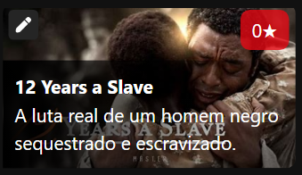

Essa conta já está cadastrada automaticamente ao importar o arquivo `app_web.sql`.

Outros usuários (como `Bruno` ou `User`) também existem no banco, mas **não possuem permissão para cadastrar, editar ou excluir filmes.**


---

### 🔐 Criar Novo Administrador

Se desejar cadastrar outro administrador:

1. Faça o registro normalmente pela tela de cadastro.
2. Em seguida, altere manualmente o campo `acess` do novo usuário no banco de dados para `admin`:

```sql
UPDATE usuario SET acess = 'admin' WHERE user = 'nome_do_novo_usuario';
```
> Isso pode ser feito no phpMyAdmin ou diretamente via linha de comando SQL.

---

## ✨ Funcionalidades

- Cadastro de novos filmes com imagem
- Visualização em estilo **galeria**
- Filtro por categoria
- Edição e exclusão de dados
- Upload de imagens com preview
- Registro/Login de usuário e segurança básica
- Confirmação em deleções
- Vídeo de introdução na landing page

---

## 🎨 Estilo e Visual

O layout da aplicação foi desenvolvido com foco exclusivo em **telas desktop**, conforme exigência da atividade.  

> [!IMPORTANT]
> Não possui responsividade para dispositivos móveis.

Os estilos estão organizados nos seguintes arquivos:

- `style.css`, `reset.css`, `dar_scroll_bar.css`

A interface utiliza miniaturas de dezenas de filmes reais para exibição visual nos cards:

- Exemplos: `avengers_endgame_small.png`, `dune_small.png`, `matrix_small.png`

Além disso, a página inicial conta com um **vídeo de introdução** (`assets/video/protector.mp4`) e ícones visuais nos cards para ações como **editar** e **excluir** registros.

---

## 📷 Capturas de Tela

Abaixo estão algumas telas do sistema em funcionamento:

#### 🏠 Página Inicial (Home)

*Visualização dos filmes em layout de galeria com imagens e categorias.*

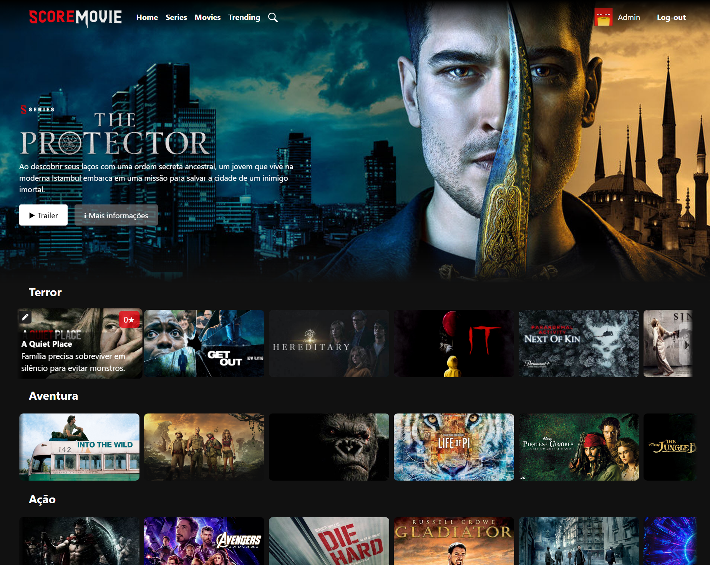

---

#### ➕ Cadastro de Filmes

*Formulário para adicionar um novo filme com título, descrição, imagem e categoria.*
- Página de cadastro vazia:


- Página de cadastro Preenchida:

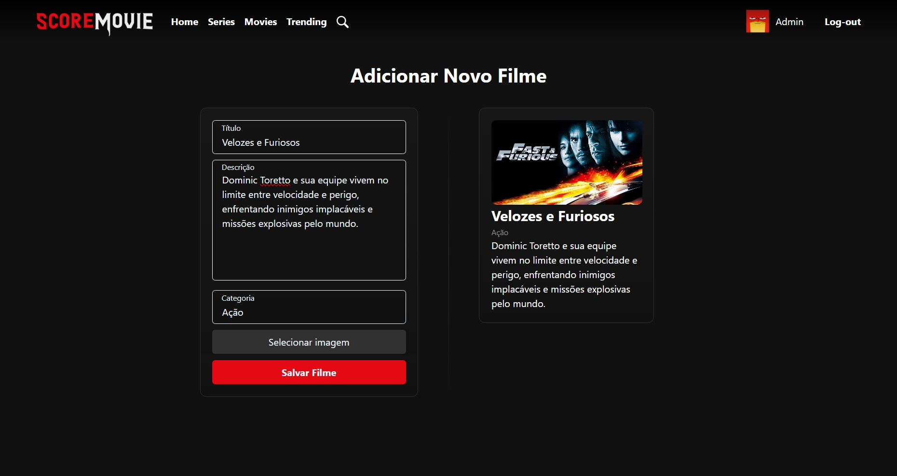

---

#### 📝 Edição de Filmes

*Interface de edição ou exclusão de dados de um filme existente.*

- Página de edição

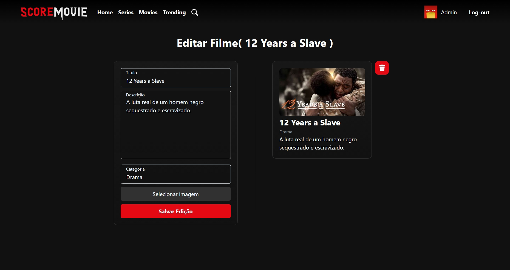
- Confirmação de exclusão

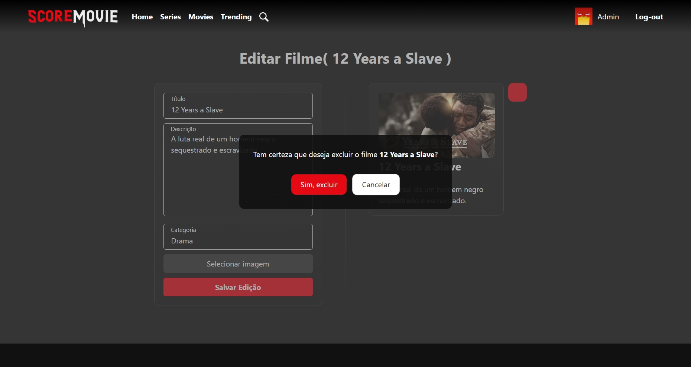

---

#### 🔍 Pesquisa por Categoria

*Busca filtrando os filmes por categoria ou nome.*

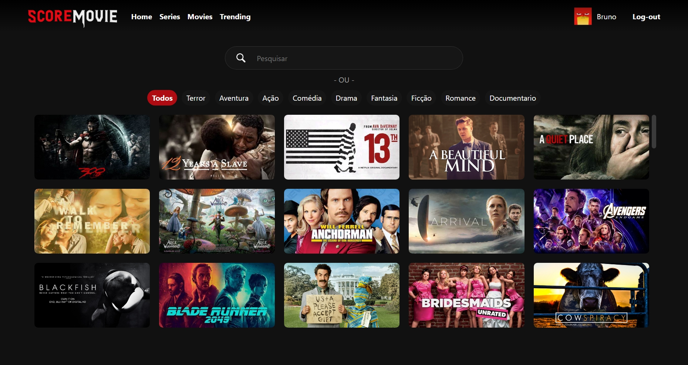

---

#### 👤 Tela de Login

*Autenticação de usuários com campos de login e senha.*

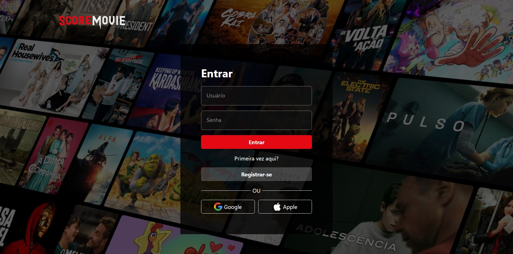

---

### 🧾 Tela de Registro

*Formulário para criação de novas contas de usuário.*

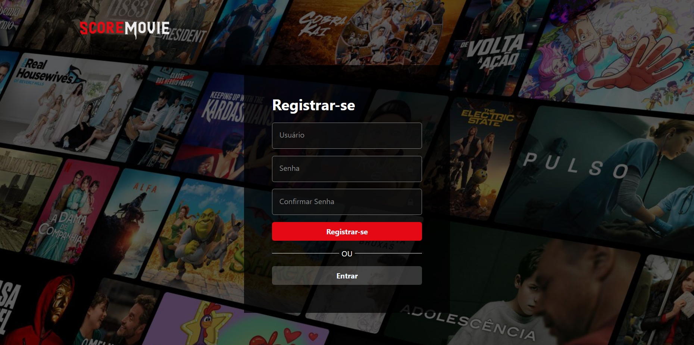

---

## 📢 Mensagens do Sistema (Alertas, Erros e Sucesso)

O sistema exibe mensagens visuais claras para informar o usuário sobre ações bem-sucedidas, erros ou avisos durante o uso.


#### 🔍 Nenhum Resultado Encontrado

*Mensagem exibida ao realizar uma busca sem resultados.*

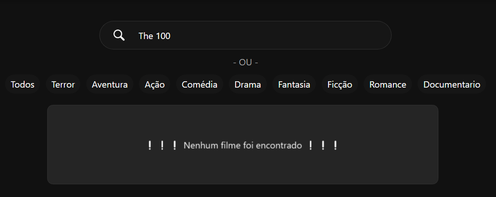

---

#### ⚠️ Registro – Usuário já existe

*Exibido quando se tenta registrar um nome de usuário que já está em uso.*

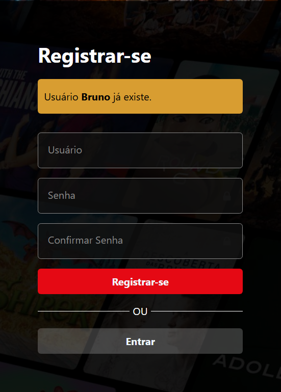

---

#### ⚠️ Registro – Senhas não coincidem

*Exibido quando as senhas digitadas não são iguais.*

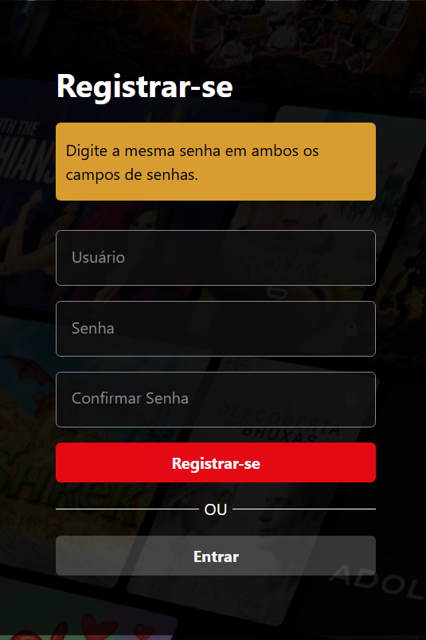

---

#### ❌ Login – Usuário não encontrado

*Mensagem ao tentar logar com um nome de usuário que não existe.*

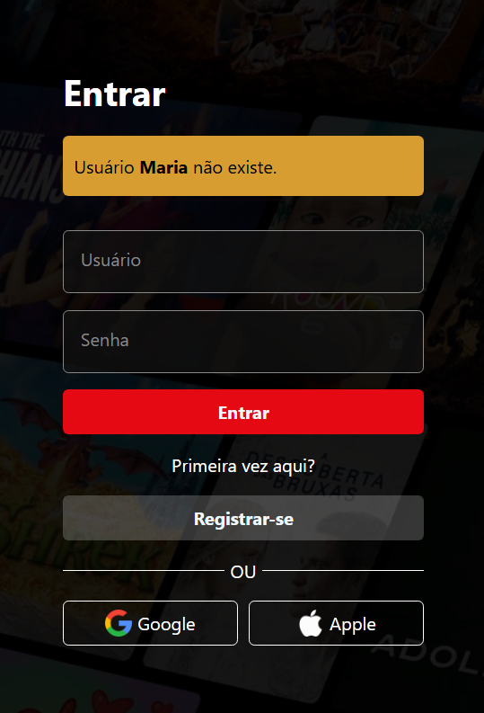

---

#### ❌ Login – Senha inválida

*Exibido quando a senha informada está incorreta.*

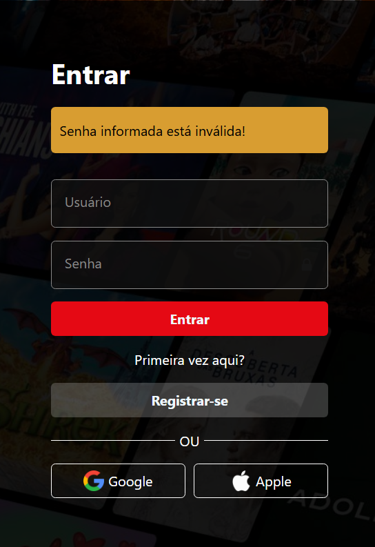

---

#### ⚠️ Cadastro de Filme – Sem imagem

*Erro ao tentar cadastrar um filme sem enviar uma imagem válida.*

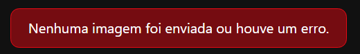

---

#### ✅ Filme Excluído com Sucesso

*Mensagem de confirmação após exclusão de um registro.*


---

#### ✅ Filme Cadastrado com Sucesso

*Mensagem exibida após cadastrar um novo filme corretamente.*


---

#### ✅ Usuário Registrado com Sucesso

*Mensagem exibida após criação de conta com sucesso.*

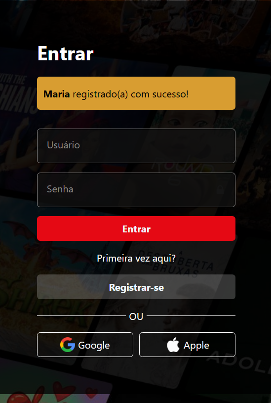

---

## 👨‍💻 Autor

- **Bruno da Silva**
- Projeto desenvolvido como atividade prática de CRUD com banco de dados relacional para sistemas WEB DESKTOP.
- GitHub: [@BrunoGitCoder](https://github.com/BrunoGitCoder?tab=repositories)

---

## 📜 Licença

Este projeto é de uso livre para fins educacionais.
